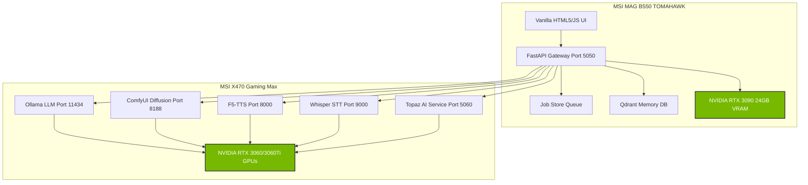
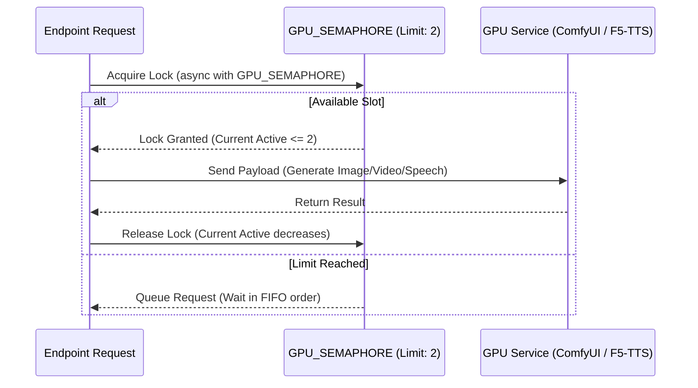
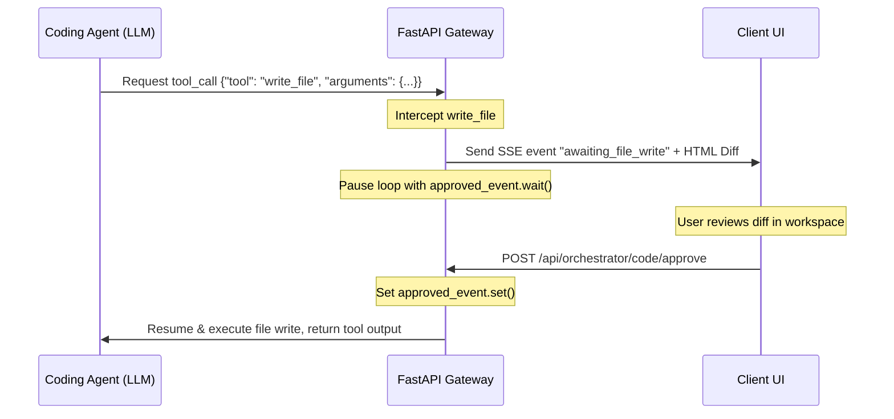

# System Architecture — ARCHITECTURE.md

This document details the multi-node hardware topology, state synchronization, orchestrator execution loops, and security sandboxing of the Spark Media Factory.

---

## 1. Node & Hardware Topology

The platform operates as a decoupled, multi-service architecture divided across dedicated hardware nodes to distribute computation loads. 



### Node A: Operations Coordinator (MSI MAG B550 TOMAHAWK)
- **FastAPI Operations (Port 5050):** Coordinates REST routers, serves static files, runs background task loops, and indexes document RAG vectors.
- **Primary GPU (RTX 3090 24GB VRAM):** Reserved for heavy visual rendering, high-resolution diffusion models (e.g., FLUX), and orchestrator prompt mappings. Also has a secondary RTX 3060 12GB dedicated to audio/music generation.

### Node B: Windows AI Worker (MSI X470 Gaming Max)
- **Ollama / ComfyUI / Voice Services:** Runs light-to-medium generation tasks (Port 11434, Port 8188, Port 9000, Port 8000).
- **Topaz Video/Photo AI Service (Port 5060):** Remote runner service providing dynamic path resolution, asynchronous execution, and logs capture for upscaling/denoising.
- **GPU Allocation:** Equipped with an NVIDIA RTX 3060 Ti 8GB (Ollama/Whisper/Topaz) and an NVIDIA RTX 3060 12GB (F5-TTS/Topaz).

*Note: In the Docker compose sandbox environment, services route to `host.docker.internal` (pointing to the Docker host itself) by default to simplify local testing.*

---

## 2. GPU Semaphore & Memory Management

To prevent concurrent diffusion models and voice synthesizers from overloading GPU VRAM (which causes silent CUDA out-of-memory crashes), the gateway implements a strict concurrency lock:

```python
# GPU semaphore — max 2 concurrent GPU-bound tasks to prevent VRAM OOM
GPU_SEMAPHORE = asyncio.Semaphore(2)
```

### Allocation Flow



Any tool marked as `GPU-bound` (such as FLUX images, LTX video generation, Hunyuan3D assets, F5-TTS speak synthesis, or Real-ESRGAN upscaling) must wrap its endpoint execution blocks inside `async with GPU_SEMAPHORE`.

---

## 3. The Stateful Orchestrator Loop

The Spark Coder workspace handles agent actions asynchronously, using Server-Sent Events (SSE) to report status and intercept writes/commands.

### Human-in-the-Loop Interception Flow



- **Write / Execute Intercepts:** When the agent calls `write_file` or `execute_bash`, the backend pauses execution using `asyncio.Event` structures tracked in the session database.
- **Approval REST API:** Approving or rejecting a change releases the corresponding event lock, resuming execution.

---

## 4. Frontend Workspace Layout & Resizers

The frontend UI splits the layout into three adjustable sections:
1. **Left Sessions Panel (`#chatSessionsSidebar`):** Drags between `200px` and `40vw` using X-axis mouse coordinates (`e.clientX`).
2. **Main Chat Column:** Autoresizes to fill the remaining horizontal center.
3. **Right Artifact Window (`#assetSidebar`):** Drags between `300px` and `50vw` using screen-width coordinates. Triggers `.layout()` updates to the Monaco Editor instance on mouse drag.

An invisible resizer handle element (`.sidebar-resizer` / `.left-sidebar-resizer`) runs the entire vertical height of each dividing border. Width transitions are disabled during active drag operations to prevent resizing lag.

---

## 5. Chat Intent Routing Flow

The gateway features a primary entry point at `/api/orchestrator/chat` that implements an intent routing system. It uses Gemma 4 (`gemma4:12b-it-qat`) to classify the user's prompt and route tasks appropriately:

```mermaid
flowchart TD
    UserQuery[User Query] --> RouteMessage[orchestrator.route_message]
    RouteMessage --> GemmaClassify{Gemma4 Classification}
    
    GemmaClassify -->|plain chat / vision| HandleChat[orchestrator.handle_chat]
    HandleChat --> ReturnReply[Return Chat Response]
    
    GemmaClassify -->|media generation request| MediaMetadata[Return Action + Params]
    MediaMetadata --> ActionCard[Frontend Renders Action Card]
    ActionCard -->|User Clicks Generate| GenerateAPI[Call /api/{action}/generate]
```

- **Intent Detection:** Analyzes queries to match actions like `image`, `video`, `audio`, `music`, `3d`, `research`, or `text`.
- **Pass-through Routing:** For plain chat or image-laden prompts (processed via `llama3.2-vision:11b`), the system skips classification and directly queries the chat generator.
- **Action Cards:** Media generation requests return the parsed params immediately, letting the frontend render a preview card that prompts the user to execute the generation via the dedicated endpoints.

---

## 6. Job Store Queue System

The `job_store.py` module manages asynchronous execution of long-running GPU tasks (e.g., video render, 3D generation, music compositions).

- **Hybrid State Store:** Employs an in-memory dictionary for rapid runtime access, backed by a SQLite database (`jobs.db` in `OUTPUT_DIR`) for persistence across container restarts.
- **SQLite Configuration:** Initialized with `PRAGMA journal_mode=WAL` (Write-Ahead Logging) to ensure concurrency safety and reliability.
- **Job States:** Tracked through five distinct string states:
  - `pending`: Task created and enqueued.
  - `running`: GPU semaphore acquired; execution in progress.
  - `completed`: Completed successfully with result payload URL.
  - `failed`: Terminated with an error trace.
  - `cancelled`: Explicitly cancelled by the user.

---

## 7. 4-Layer Security Model

The system enforces a multi-layered security defense stack to shield the host and container from malicious inputs and unauthorized commands:

1. **Layer 1: Body Size Limiting:** A `LimitRequestSizeMiddleware` blocks uploads or payloads exceeding `200MB` directly at the HTTP server level to prevent Denial of Service (DoS) attacks.
2. **Layer 2: CORS Middleware:** Restricted cross-origin resource sharing filters prevent client UI hijackings by verifying origin requests against an allowlist.
3. **Layer 3: Path and Command Allowlist:** 
   - Path operations must pass `is_safe_path()` checks validating they reside within the `WORKSPACE_ROOT` sandbox.
   - Command executions via the coding agent check `ALLOWED_COMMANDS` (e.g., `python`, `pip`, `ls`, `git`, `grep`) and reject dangerous flag combinations (e.g., `rm -rf`, `--delete`).
4. **Layer 4: Security Scanner Chain:**
   - Any modifications to Python package descriptors (`requirements.txt`) are scanned using Bumblebee (or `pip-audit` CVE checks as a fallback).
   - If vulnerabilities or malicious packages (e.g., typosquatted packages) are found, the write is immediately rolled back.
   - Commands are statically audited via `security_scanner.py` regex checks to block common pipeline-injection patterns (e.g., piping curl/wget to bash, `/etc/passwd` reads).

---

## 8. SSE Event Registry

The stateful Coding Agent loop communication with the frontend is orchestrated via Server-Sent Events (SSE) at `/api/orchestrator/code/stream`. The stream emits 7 distinct event types:

| Event Type | Data Payload Content | Purpose |
| :--- | :--- | :--- |
| `log` | `{"content": "..."}` | General status logs and progress notes displayed in the terminal UI. |
| `status` | `{"status": "completed"/"finished", "resolution": "..."}` | Notifies the client of loop termination and the final resolution. |
| `plan` | `{"plan": "# markdown text"}` | Transmits live updates to the agent's plan block (`PLAN.md`). |
| `awaiting_file_write` | `{"path": "...", "diff": "HTML table"}` | Pauses the agent, prompting the user with an HTML-based side-by-side diff. |
| `awaiting_command_run`| `{"command": "..."}` | Pauses the agent, requesting permission to execute the specified command. |
| `terminal_log` | `{"stream": "stdout"/"stderr", "content": "..."}` | Streams live command execution stdout/stderr directly to the terminal view. |

---

## 9. Multi-Engine RAG Routing

The RAG subsystem (`rag.py`) supports multiple search backends configured dynamically using the `RAG_ENGINE` environment variable:

- **Local Qdrant Mode (`local`):** Employs a local Qdrant container and utilizes the local Ollama `/api/embed` endpoint with `nomic-embed-text` to generate vector representations.
- **RAGFlow Mode (`ragflow`):** Routes embedding generation and retrieval queries to an external RAGFlow platform instance.
- **AnythingLLM Mode (`anythingllm`):** Integrates directly with AnythingLLM workspace APIs.

---

## 10. Telemetry & Langfuse Tracing

The `telemetry.py` utility traces and evaluates LLM generations. 

- **Langfuse Client:** Authenticates using `LANGFUSE_PUBLIC_KEY`, `LANGFUSE_SECRET_KEY`, and `LANGFUSE_HOST`.
- **Generation Spans:** Traces each orchestrator chat prompt, system prompt, completion response, error code, and execution latency.
- **Graceful Degradation:** If the Langfuse server is unreachable or the library is missing, the application automatically disables telemetry tracing without interrupting core services.
