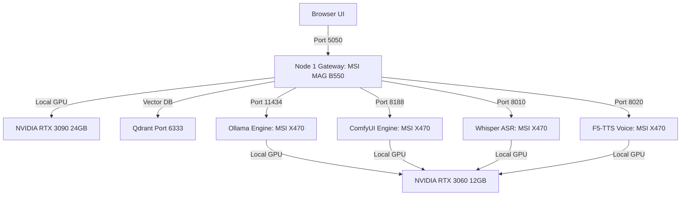

# Operations Guide — README.md (v1.2.0)

Spark Media Factory is a multi-node, local-first artificial intelligence workstation for generating text, images, videos, speech, and code. The system aggregates ComfyUI, Ollama, Whisper, F5-TTS, and Qdrant into a unified operations gateway.

---

## 0. System Prerequisites & Layout

### Prerequisites
- **Python:** Version 3.10+
- **Docker:** Version 24+ with Compose V2
- **Hardware (Node A):** NVIDIA GPU with 24GB VRAM (e.g. RTX 3090) + CUDA 12+
- **Host Drivers:** NVIDIA Driver branch v610+

### Directory Structure
```
spark-test-tool/
├── .spark_coder/         # Agent workspace settings & MEMORY.md
├── app/                  # FastAPI Application Source
│   ├── backends/         # Core backends (job_store, security_scanner, rag, etc.)
│   ├── mail_agent/       # Email synchronization and cleanup system
│   ├── static/           # Client UI files (HTML, CSS, JS)
│   └── main.py           # FastAPI entrypoint
├── docs/                 # Documentation directory
│   ├── ENVIRONMENT_VARIABLES.md
│   ├── KNOWN_ISSUES.md
│   ├── MAIL_AGENT.md
│   ├── RAG_ARCHITECTURE.md
│   └── WORKBENCH_TOOLS.md
├── docker-compose.yml    # Docker services config
├── start.sh              # Workstation startup script
└── requirements.txt      # Python dependencies
```

---

## 1. Node & Service Configuration Matrix

The workstation divides computational loads across two physical machines based on GPU power:

### Physical Hardware Splitting
- **Node A (Workstation Host / Coordinator):** MSI MAG B550 TOMAHAWK workstation host equipped with an NVIDIA RTX 3090 24GB and RTX 3060 12GB. Runs the Docker gateway, Qdrant, Whisper, and F5-TTS containers. Also hosts Ollama/ComfyUI processes locally.
- **Node B (Windows AI Worker / Secondary):** MSI X470 Gaming Max workstation running Windows 11 Pro with an NVIDIA RTX 3060 Ti 8GB and RTX 3060 12GB. Used for remote workload distribution (Ollama, Whisper, F5-TTS).
- **Node D (Hyper-V VM):** Ubuntu VM running inside Node C (HP Pavilion) on CPU-only, used for sandboxed tests (not for high-performance AI serving).

### Service Mapping Table (Docker & Host)

| Node | Service Name | Docker Container | Internal Port | Host Port | Purpose |
| :--- | :--- | :--- | :--- | :--- | :--- |
| **Node A** | Operations Gateway | `spark-gateway` | `5050` | `5050` | FastAPI Backend & Client UI |
| **Node A** | Qdrant DB | `spark-qdrant` | `6333` | `6333` | Semantic Vector Storage |
| **Node A** | Ollama Engine (Host) | - | `11434` | `11434` | Local LLMs (routed via host.docker.internal) |
| **Node A** | ComfyUI Workflows (Host) | - | `8188` | `8188` | FLUX / LTX-Video (routed via host.docker.internal) |
| **Node A** | Whisper ASR | `spark-whisper` | `9000` | `8010` | Speech-to-Text Container |
| **Node A** | F5-TTS Service | `spark-f5tts` | `8000` | `8020` | Speech Voice Synthesis Container |
| **Node B** | Topaz AI Service | - | `5060` | `5060` | Remote Topaz Video/Photo AI Runner (Windows Host) |

---

## 2. API Quick Reference Guide

Below is a summary of the primary gateway routes. All endpoints are prefixed by the Node 1 Gateway URL (`http://localhost:5050`):

| Method | Endpoint Route | Request Content-Type | Response Return | Purpose |
| :--- | :--- | :--- | :--- | :--- |
| `GET` | `/health` | - | `application/json` | Node 1 gateway health check |
| `POST` | `/api/text/chat` | `application/json` | `text/event-stream` | Streaming chat generation |
| `POST` | `/api/image/generate` | `application/json` | `application/json` | Generates a static PNG asset |
| `POST` | `/api/video/generate` | `application/json` | `application/json` | Enqueues video rendering (job queue) |
| `POST` | `/api/audio/speak` | `application/json` | `audio/wav` (binary) | Synthesizes spoken WAV audio |
| `POST` | `/api/audio/transcribe`| `multipart/form-data`| `application/json` | Transcribes audio file to text |
| `POST` | `/api/extract/pdf` | `multipart/form-data`| `application/json` | Extracts text pages from PDF |
| `POST` | `/api/rag/query` | `application/json` | `application/json` | Query vector database memory |
| `GET` | `/api/jobs/{job_id}` | - | `application/json` | Poll state of background queue tasks |

---

## 3. System Topology Diagram



---

## 4. Operational Startup Sequence

Follow this sequence to launch the entire environment:

### Step 1: Start Node 2 Inference Services
Verify that Ollama, ComfyUI, and Hyper-V Ubuntu network ports are active and listening.

### Step 2: Spin Up Node 1 Gateway Containers
Execute the launch script to bootstrap the operations gateway, Qdrant database, and Node 2 mapped container services (Whisper, F5-TTS):
```bash
chmod +x start.sh
./start.sh
```

### Step 3: Run Verification Suite
Verify network links and model responses across all gateway connections:
```bash
python run_smoke_tests.py
```
