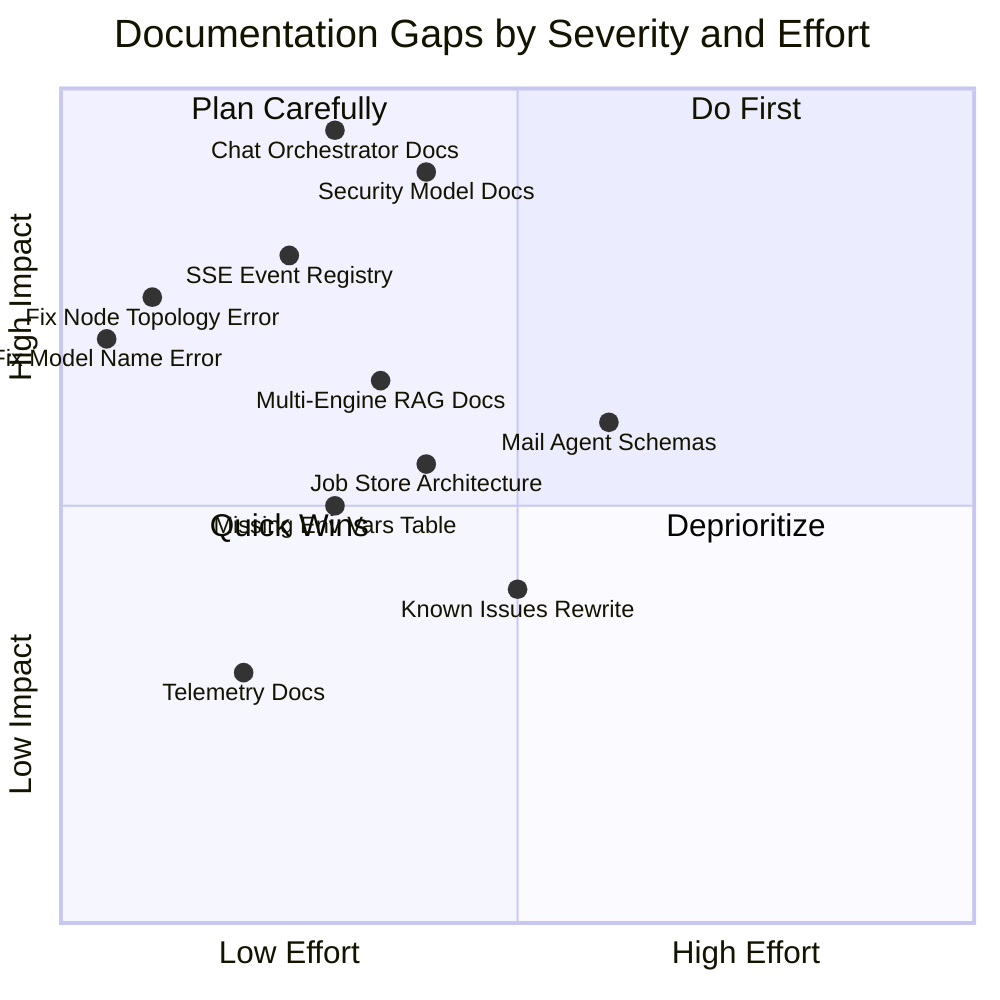

# Documentation Quality Audit — Spark Media Factory

> Cross-referenced against live codebase on 2026-06-16. Every finding is verified against actual source code.

---

## Executive Summary

| Document | Lines | Score | Verdict |
|:---|---:|:---:|:---|
| [README.md](file:///home/pkkumar/AGGY/spark-test-tool/README.md) | 83 | **6/10** | Good ops guide, but API table covers only 9 of 52 endpoints |
| [ARCHITECTURE.md](file:///home/pkkumar/AGGY/spark-test-tool/ARCHITECTURE.md) | 108 | **7/10** | Best document — has Mermaid diagrams, GPU semaphore, SSE flow |
| [docs/WORKBENCH_TOOLS.md](file:///home/pkkumar/AGGY/spark-test-tool/docs/WORKBENCH_TOOLS.md) | 440 | **8/10** | Most complete — 27 endpoint schemas documented |
| [docs/RAG_ARCHITECTURE.md](file:///home/pkkumar/AGGY/spark-test-tool/docs/RAG_ARCHITECTURE.md) | 60 | **5/10** | Correct but shallow — missing multi-engine routing, keyword search |
| [docs/KNOWN_ISSUES.md](file:///home/pkkumar/AGGY/spark-test-tool/docs/KNOWN_ISSUES.md) | 59 | **4/10** | Mostly a model download checklist, not an issues registry |
| [.spark_coder/MEMORY.md](file:///home/pkkumar/AGGY/spark-test-tool/.spark_coder/MEMORY.md) | 21 | **5/10** | Concise but has a factual error and missing subsystems |

**Composite Score: 5.8/10** — Solid foundation with critical blind spots that would mislead both human operators and AI agents.

---

## Document-by-Document Analysis

### 1. README.md — Score: 6/10

#### ✅ What's Good
- Service Mapping Table (L17–L24) correctly maps all 6 Docker containers with internal→host port mappings
- Hardware splitting section (L12–L13) clearly identifies the two physical machines and their GPUs
- Mermaid topology diagram (L48–L60) accurately shows the cross-node service graph
- Startup sequence (L64–L82) references `start.sh` and `run_smoke_tests.py` — both verified to exist

#### ❌ Factual Errors

| Line | Error | Actual Code |
|:---|:---|:---|
| L13 | States Node 2 is "MSI X470 Gaming Max...running an Ubuntu VM via Hyper-V" | Contradicts [spark_master_rag_manifest.md](file:///home/pkkumar/AGGY/spark-test-tool/app/data/spark_master_rag_manifest.md) which lists Node B (GPU-PC) as a **Windows 11 Pro** machine, not a VM. The Hyper-V Ubuntu VM is actually Node D (inside Node C/HP Pavilion). |
| L21 | Ollama listed on **Node 2** at port `11434` | [docker-compose.yml](file:///home/pkkumar/AGGY/spark-test-tool/docker-compose.yml) L35 shows `OLLAMA_URL=http://host.docker.internal:11434` — this routes to the **Docker host** (Node 1), not a remote node. The actual remote Ollama would be at `10.0.0.162:11434` per the RAG manifest. |
| L22 | ComfyUI listed on **Node 2** at port `8188` | [docker-compose.yml](file:///home/pkkumar/AGGY/spark-test-tool/docker-compose.yml) L36 shows `COMFYUI_URL=http://host.docker.internal:8188` — same issue, routes to Docker host. |

#### ❌ Missing Content

| Gap | Impact | Source Reference |
|:---|:---|:---|
| **43 missing API endpoints** | API table (L32–L43) covers 9 routes. Actual codebase has **52 routes** (38 in [main.py](file:///home/pkkumar/AGGY/spark-test-tool/app/main.py) + 14 in [mail_routes.py](file:///home/pkkumar/AGGY/spark-test-tool/app/mail_agent/mail_routes.py)). | `grep -c '@app\.\|@router\.' main.py mail_routes.py` |
| **No version number** | App is `v1.2.0` per [main.py L76](file:///home/pkkumar/AGGY/spark-test-tool/app/main.py#L76) | `version="1.2.0"` |
| **No environment variables reference** | 15+ env vars control behavior (`.env`, `.env.example`) | [.env.example](file:///home/pkkumar/AGGY/spark-test-tool/.env.example) |
| **No directory tree** | Standard for ops guides | — |
| **No prerequisites section** | Python version, Docker version, NVIDIA driver, etc. | — |

---

### 2. ARCHITECTURE.md — Score: 7/10

#### ✅ What's Good
- GPU Semaphore section (L41–L69) is **accurate** — code at [main.py L47](file:///home/pkkumar/AGGY/spark-test-tool/app/main.py#L47) confirms `asyncio.Semaphore(2)`
- SSE Human-in-the-Loop diagram (L79–L93) correctly describes the `approved_event.wait()` pattern verified in [coding_agent.py L505–L535](file:///home/pkkumar/AGGY/spark-test-tool/app/backends/coding_agent.py#L505)
- Frontend resizer documentation (L100–L107) matches the implemented drag handles

#### ❌ Missing Critical Subsystems

| Missing Subsystem | Lines of Code | Why It Matters |
|:---|---:|:---|
| **Chat Orchestrator routing flow** | 270 lines in [orchestrator.py](file:///home/pkkumar/AGGY/spark-test-tool/app/backends/orchestrator.py) | The system's **primary user-facing entry point** (`/api/orchestrator/chat`) — routes through Gemma4 intent detection → action dispatch. Completely absent from ARCHITECTURE.md. |
| **Job Store queue system** | 256 lines in [job_store.py](file:///home/pkkumar/AGGY/spark-test-tool/app/backends/job_store.py) | In-memory + SQLite persistence for all async GPU jobs (video, music, 3D, meme, upscale). No architecture diagram. |
| **4-Layer Security Model** | Across 3 files | Layer 1: `LimitRequestSizeMiddleware` 200MB cap ([main.py L81–L91](file:///home/pkkumar/AGGY/spark-test-tool/app/main.py#L81)). Layer 2: CORS origin allowlist ([main.py L94–L104](file:///home/pkkumar/AGGY/spark-test-tool/app/main.py#L94)). Layer 3: Command allowlist + sandbox path validation ([coding_agent.py L20–L30](file:///home/pkkumar/AGGY/spark-test-tool/app/backends/coding_agent.py#L20)). Layer 4: Bumblebee/pip-audit/static signature scanner ([security_scanner.py](file:///home/pkkumar/AGGY/spark-test-tool/app/backends/security_scanner.py)). |
| **SSE Event Type Registry** | 7 distinct types | `log`, `status`, `plan`, `awaiting_file_write`, `awaiting_command_run`, `terminal_log` — none documented. |
| **Multi-engine RAG routing** | 3 backends in [rag.py](file:///home/pkkumar/AGGY/spark-test-tool/app/backends/rag.py#L14) | Local Qdrant / RAGFlow / AnythingLLM — selected by `RAG_ENGINE` env var. Only local Qdrant is documented. |
| **Telemetry / Langfuse integration** | 82 lines in [telemetry.py](file:///home/pkkumar/AGGY/spark-test-tool/app/backends/telemetry.py) | Traces all LLM generations to a local Langfuse instance. Not mentioned anywhere. |
| **Mail Agent subsystem** | 14 endpoints in [mail_routes.py](file:///home/pkkumar/AGGY/spark-test-tool/app/mail_agent/mail_routes.py) | Full email sync, search, cleanup, deep-purge. Mounted at `/api/mail/*`. Zero documentation. |
| **Dify Workflow Orchestrator** | 84 lines in [dify_orchestrator.py](file:///home/pkkumar/AGGY/spark-test-tool/app/backends/dify_orchestrator.py) | External Dify App workflow trigger at `/api/dify/run-workflow`. Supports blocking + streaming modes. Not documented. |

---

### 3. docs/WORKBENCH_TOOLS.md — Score: 8/10

#### ✅ What's Good
- **Most comprehensive document** — 440 lines, 27 endpoint schemas with full JSON input schemas
- Correctly groups endpoints by functional pillar (Text, Image, Audio, RAG, etc.)
- Includes multipart form field specs for file uploads (PDF, audio, lipsync)
- `search_mode` enum (`semantic`/`keyword`) correctly documented for RAG query

#### ❌ Missing Schemas (Code Exists, Docs Don't)

| Missing Endpoint | Route | Source |
|:---|:---|:---|
| `GET /api/text/models` | Lists available Ollama models | [main.py L254](file:///home/pkkumar/AGGY/spark-test-tool/app/main.py#L254) |
| `GET /api/rag/sources` | Lists all ingested RAG source files | [main.py L443](file:///home/pkkumar/AGGY/spark-test-tool/app/main.py#L443) |
| `GET /api/gpu/status` | nvidia-smi GPU utilization stats | [main.py L176](file:///home/pkkumar/AGGY/spark-test-tool/app/main.py#L176) |
| `GET /api/assets` | Lists all generated output files | [main.py L981](file:///home/pkkumar/AGGY/spark-test-tool/app/main.py#L981) |
| `GET /output/{filename}` | Serves generated files with path traversal protection | [main.py L1017](file:///home/pkkumar/AGGY/spark-test-tool/app/main.py#L1017) |
| `POST /api/orchestrator/chat` | **Primary chat orchestrator** | [main.py L796](file:///home/pkkumar/AGGY/spark-test-tool/app/main.py#L796) |
| `GET /api/orchestrator/code/stream` | SSE coding agent stream | [main.py L698](file:///home/pkkumar/AGGY/spark-test-tool/app/main.py#L698) |
| `POST /api/orchestrator/code/approve` | Approve file write/command | [main.py L728](file:///home/pkkumar/AGGY/spark-test-tool/app/main.py#L728) |
| `POST /api/orchestrator/code/reject` | Reject with feedback | [main.py L743](file:///home/pkkumar/AGGY/spark-test-tool/app/main.py#L743) |
| `GET/POST /api/orchestrator/code/memory` | Agent memory CRUD | [main.py L760–L785](file:///home/pkkumar/AGGY/spark-test-tool/app/main.py#L760) |
| `POST /api/dify/run-workflow` | Dify workflow trigger | [main.py L677](file:///home/pkkumar/AGGY/spark-test-tool/app/main.py#L677) |
| `POST /api/gems/ingest-source` | Chat-with-source file ingest | [main.py L654](file:///home/pkkumar/AGGY/spark-test-tool/app/main.py#L654) |
| All 14 `/api/mail/*` routes | Mail agent subsystem | [mail_routes.py](file:///home/pkkumar/AGGY/spark-test-tool/app/mail_agent/mail_routes.py) |

#### ❌ Incomplete Schema Fields

| Endpoint | Missing Fields | Actual Code |
|:---|:---|:---|
| `POST /api/extract/pdf` (L175–L184) | `fix_broken_sentences`, `preserve_paragraphs` | [main.py L393–L394](file:///home/pkkumar/AGGY/spark-test-tool/app/main.py#L393) |
| `POST /api/extract/link` (L186–L201) | `fix_broken_sentences`, `preserve_paragraphs`, `chunking_strategy` | [main.py L416–L420](file:///home/pkkumar/AGGY/spark-test-tool/app/main.py#L416) |
| `POST /api/rag/ingest` (L220–L234) | `chunk_overlap`, `chunking_strategy` | [main.py L455–L457](file:///home/pkkumar/AGGY/spark-test-tool/app/main.py#L455) |

---

### 4. docs/RAG_ARCHITECTURE.md — Score: 5/10

#### ✅ What's Good
- Mermaid ingestion pipeline diagram (L21–L27) correctly shows the 4-step flow
- Dual-search (semantic + keyword) diagram (L41–L51) is accurate
- Embedding model (`nomic-embed-text`, 768-dim) is correct per [rag.py L29](file:///home/pkkumar/AGGY/spark-test-tool/app/backends/rag.py#L29)

#### ❌ Issues

| Issue | Detail |
|:---|:---|
| **Stale Ollama API reference** (L33) | States "sent to Ollama's `/api/embeddings` endpoint" — actual code uses `/api/embed` (modern Ollama v0.5+ format) per [rag.py L28](file:///home/pkkumar/AGGY/spark-test-tool/app/backends/rag.py#L28) |
| **Missing multi-engine routing** | [rag.py L14](file:///home/pkkumar/AGGY/spark-test-tool/app/backends/rag.py#L14) implements 3 backends (`local`, `ragflow`, `anythingllm`) controlled by `RAG_ENGINE` env var. Document only describes local Qdrant. |
| **Missing keyword search implementation** | L57–L59 describes keyword search conceptually but doesn't document that it uses a **full collection scroll + in-memory string matching** (not Qdrant payload filters as stated) per [rag.py L346–L385](file:///home/pkkumar/AGGY/spark-test-tool/app/backends/rag.py#L346) |
| **Missing `list_sources` / `delete_source` / `clear_all`** | Three critical management functions undocumented |

---

### 5. docs/KNOWN_ISSUES.md — Score: 4/10

#### ✅ What's Good
- ComfyUI text encoder path constraint (L9–L11) is the single most critical hardware rule — correctly documented
- Model download commands are accurate and verified

#### ❌ Issues

| Issue | Detail |
|:---|:---|
| **Not actually an "issues" document** | 90% of content is a model download checklist that duplicates [pending_model_tasks.md](file:///home/pkkumar/AGGY/spark-test-tool/pending_model_tasks.md). Only 1 actual "known issue" (text encoder path constraint). |
| **Missing known runtime issues** | No mention of: CUDA OOM on concurrent 14B model + FLUX, Whisper container cold start latency, SearXNG rate limiting, `nltk punkt_tab` download requirement at first run |
| **Missing operational gotchas** | No mention of: `host.docker.internal` DNS resolution failing on some Linux kernels, volume mount permissions for `/comfyui-output:ro`, SQLite WAL mode concurrency limits |

---

### 6. .spark_coder/MEMORY.md — Score: 5/10

#### ✅ What's Good
- Architecture rules (L9–L16) are concise and actionable for the coding agent
- Git/GitHub push restriction (L15) and human-in-the-loop safeguard (L16) are correctly documented

#### ❌ Issues

| Line | Error | Actual |
|:---|:---|:---|
| L6 | States orchestrator model is `gemma4:12b` | Actual: `gemma4:12b-it-qat` per [main.py L792](file:///home/pkkumar/AGGY/spark-test-tool/app/main.py#L792) |
| — | Missing Mail Agent subsystem | 14 endpoints, fully mounted at `/api/mail/*` |
| — | Missing Dify Orchestrator | `/api/dify/run-workflow` exists in code |
| — | Missing security scanner module | `security_scanner.py` audits all file writes + command executions |
| — | Missing telemetry/Langfuse integration | `telemetry.py` traces LLM calls |
| — | Missing SSE event types for coding agent | 7 event types control the agent loop |

---

## Gap Severity Matrix

---

## Priority Remediation Checklist

### 🔴 Priority 1 — Factual Errors (Fix Immediately)

- [ ] **Fix MEMORY.md model name**: `gemma4:12b` → `gemma4:12b-it-qat`
- [ ] **Fix README.md node topology**: Node 2 description conflates the Windows AI Worker (Node B) with the Hyper-V Ubuntu VM (Node D)
- [ ] **Fix README.md service mapping**: Ollama and ComfyUI are routed via `host.docker.internal` (Docker host), not a remote "Node 2"
- [ ] **Fix RAG_ARCHITECTURE.md API path**: `/api/embeddings` → `/api/embed`

### 🟠 Priority 2 — Missing Critical Documentation (~200 lines to add)

- [ ] **ARCHITECTURE.md: Chat Orchestrator** — Add Mermaid diagram showing `route_message()` → Gemma4 intent classification → `handle_chat()` dispatch with context injection
- [ ] **ARCHITECTURE.md: 4-Layer Security Model** — Document the defense stack (body size limit → CORS → command allowlist → Bumblebee/pip-audit scanner)
- [ ] **ARCHITECTURE.md: SSE Event Registry** — Table of all 7 event types: `log`, `status`, `plan`, `awaiting_file_write`, `awaiting_command_run`, `terminal_log`
- [ ] **WORKBENCH_TOOLS.md: Orchestrator endpoints** — Add schemas for `/api/orchestrator/chat`, `/api/orchestrator/code/*`

### 🟡 Priority 3 — Missing Subsystem Documentation (~150 lines to add)

- [ ] **ARCHITECTURE.md: Job Store** — SQLite-backed queue with in-memory cache, WAL mode, 5 status states
- [ ] **ARCHITECTURE.md: Multi-engine RAG** — Qdrant/RAGFlow/AnythingLLM routing via `RAG_ENGINE` env var
- [ ] **ARCHITECTURE.md: Telemetry** — Langfuse trace integration for all LLM calls
- [ ] **New: docs/MAIL_AGENT.md** — 14 endpoint schemas for the mail subsystem
- [ ] **New: docs/ENVIRONMENT_VARIABLES.md** — Complete env var reference from `.env.example`

### 🟢 Priority 4 — Structural Improvements

- [ ] **Rewrite KNOWN_ISSUES.md** — Convert from download checklist to actual runtime issues registry
- [ ] **Add version number** to README.md header (`v1.2.0`)
- [ ] **Add directory tree** to README.md
- [ ] **Add prerequisites** to README.md (Python 3.10+, Docker 24+, NVIDIA Driver 610+, CUDA 12+)
- [ ] **MEMORY.md: Add missing subsystems** — Mail Agent, Dify, security_scanner, telemetry

---

## Estimated Remediation Effort

| Priority | Items | Est. Lines | Est. Time |
|:---|---:|---:|:---|
| 🔴 P1 — Fix Errors | 4 | ~20 | 15 min |
| 🟠 P2 — Critical Docs | 4 | ~200 | 2 hours |
| 🟡 P3 — Subsystem Docs | 5 | ~150 | 1.5 hours |
| 🟢 P4 — Structural | 5 | ~80 | 45 min |
| **Total** | **18** | **~450** | **~4.5 hours** |
