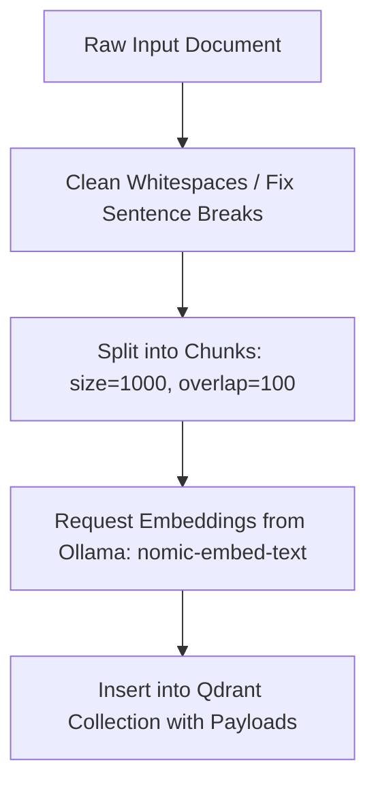
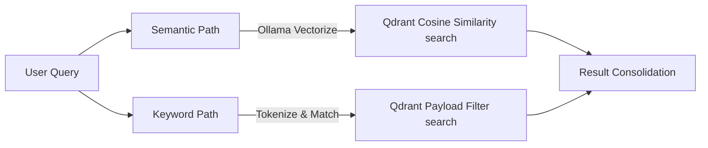

# X12 — Knowledge Base / RAG

## Chapter Card
**Chapter:** `X12 — Knowledge Base / RAG`  
**Layer:** `Planning`  
**Status:** ✅ IMPLEMENTED  
**Purpose (1 line):** Build reusable knowledge from documents using vector embeddings for retrieval-augmented generation.  
**Last Verified:** 2026-06-15  

**Actual Implementation:**
- **File:** `app/backends/rag.py` (475 lines)
- **Vector DB:** Qdrant (port 6333)
- **Embeddings:** Ollama nomic-embed-text:v1.5 (768-dim)
- **Multi-engine:** Local Qdrant, RAGFlow, AnythingLLM with automatic fallback

**System Architecture Diagrams:**

#### Data Ingestion Pipeline


#### Query Retrieval Modes


**API Endpoints:**
| Endpoint | Method | Purpose |
|----------|--------|---------|
| `/api/rag/ingest` | POST | Chunk and ingest text into vector DB |
| `/api/rag/query` | POST | Semantic search over ingested documents |
| `/api/rag/sources` | GET | List all ingested sources |
| `/api/rag/delete-source` | POST | Delete a specific source |
| `/api/rag/clear-all` | POST | Clear entire knowledge base |

**Quality Gates:**
- Gate 1: Documents chunked and embedded successfully
- Gate 2: Semantic search returns relevant results (score > 0.5)
- Gate 3: Source listing shows ingested documents

---

## 1) Quickstart (Golden Path)

### Goal
Ingest a document and query it using semantic search.

### When to run
- Before script writing (X13) to add context
- When building a knowledge base for a project
- For fact-checking against reference documents

### Golden Path Steps
1) **Ingest a document**:
   ```bash
   curl -X POST http://localhost:5050/api/rag/ingest \
     -H "Content-Type: application/json" \
     -d '{
       "text": "The Spark Media Factory is a local AI workstation...",
       "metadata": {"source_name": "readme", "source_type": "documentation"},
       "chunk_size": 1000,
       "chunk_overlap": 100,
       "chunking_strategy": "sentence"
     }'
   ```
   Expected: `{"status": "success", "engine": "local", "chunks_ingested": 3}`

2) **Query the knowledge base**:
   ```bash
   curl -X POST http://localhost:5050/api/rag/query \
     -H "Content-Type: application/json" \
     -d '{
       "query": "What is the Spark Media Factory?",
       "limit": 3,
       "search_mode": "semantic"
     }'
   ```
   Expected: Array of hits with text, score, source

3) **List ingested sources**:
   ```bash
   curl http://localhost:5050/api/rag/sources
   ```
   Expected: `{"sources": [{"source_id": "readme", "chunks": 3}]}`

### Done looks like
- [ ] Document ingested successfully
- [ ] Semantic search returns relevant results
- [ ] Source appears in source listing
- [ ] Results have scores > 0.5

---

## 2) Factory Contract (Inputs → Outputs → DoD)

### Required Inputs
| Input | Path/Key | Notes |
|-------|----------|-------|
| Text content | `text` field | Raw text to ingest |
| Query | `query` field | Search text |

### Optional Inputs
| Input | Path/Key | Notes |
|-------|----------|-------|
| Metadata | `metadata` field | Source name, type, etc. |
| Chunk size | `chunk_size` | Default: 1000 chars |
| Chunk overlap | `chunk_overlap` | Default: 100 chars |
| Chunking strategy | `chunking_strategy` | "sentence" or "fixed" |
| Search limit | `limit` | Default: 3 results |
| Search mode | `search_mode` | "semantic" or "keyword" |

### Required Outputs
| Output | Path | Notes |
|--------|------|-------|
| Ingestion status | Response | `{"status": "success", "chunks_ingested": N}` |
| Search hits | Response | Array of `{text, score, source, tool}` |
| Source list | Response | Array of `{source_id, source_name, chunks}` |

### Definition of Done (DoD)
Documents ingested + search returns relevant results + sources trackable.

---

## 3) Config & Standards

### Config keys used
| Key | Default | Meaning |
|-----|---------|---------|
| `OLLAMA_URL` | `http://host.docker.internal:11434` | Ollama endpoint |
| `QDRANT_URL` | `http://host.docker.internal:6333` | Qdrant endpoint |
| `RAG_ENGINE` | `local` | Engine: "local", "ragflow", "anythingllm" |
| `RAGFLOW_URL` | `http://host.docker.internal:9380` | RAGFlow endpoint |
| `RAGFLOW_API_KEY` | `""` | RAGFlow API key |
| `RAGFLOW_DATASET_ID` | `""` | RAGFlow dataset ID |
| `ANYTHINGLLM_URL` | `http://host.docker.internal:3001` | AnythingLLM endpoint |
| `ANYTHINGLLM_API_KEY` | `""` | AnythingLLM API key |
| `ANYTHINGLLM_WORKSPACE` | `spark-test-tool` | AnythingLLM workspace |

### Collection Configuration
- **Collection name:** `media_factory_extractions`
- **Vector size:** 768 (nomic-embed-text)
- **Distance:** Cosine similarity

### Chunking Defaults
- **Chunk size:** 1000 characters
- **Chunk overlap:** 100 characters
- **Strategy:** Sentence-based (NLTK punkt tokenizer)

---

## 4) Tooling (Approved Stack)

### Primary (default)
- **Vector DB:** Qdrant
  - **Version:** Latest (Docker image)
  - **Endpoint:** `http://qdrant:6333`
  - **Strengths:** Fast, easy setup, REST API
  - **Weaknesses:** Single-node only

- **Embeddings:** Ollama nomic-embed-text
  - **Model:** `nomic-embed-text:v1.5`
  - **Dimensions:** 768
  - **Endpoint:** `http://host.docker.internal:11434`
  - **Strengths:** Local, fast, good quality
  - **Weaknesses:** Requires GPU for speed

### Alternatives (approved)
- **RAGFlow** — Full RAG platform with document parsing
  - **When to use:** Complex document formats, need advanced chunking
  - **Endpoint:** `http://host.docker.internal:9380`

- **AnythingLLM** — All-in-one RAG solution
  - **When to use:** Need workspace management, chat interface
  - **Endpoint:** `http://host.docker.internal:3001`

### Engine Fallback Chain
1. AnythingLLM (if configured)
2. RAGFlow (if configured)
3. Local Qdrant (default)

---

## 5) Procedure (Operator Steps)

### Step 1 — Ensure Collection Exists
- **Inputs:** None
- **Action:** `ensure_collection()` creates Qdrant collection if missing
- **Expected output:** Collection `media_factory_extractions` exists
- **Common failures:** Qdrant not running
- **Fix:** `docker compose restart qdrant`

### Step 2 — Chunk Text
- **Inputs:** Raw text, chunk_size, chunk_overlap, strategy
- **Action:** Split text into chunks
- **Expected output:** List of text chunks
- **Common failures:** NLTK tokenizer not downloaded
- **Fix:** Auto-downloads on first use, or falls back to regex splitter

### Step 3 — Generate Embeddings
- **Inputs:** Text chunks
- **Action:** Call Ollama `/api/embed` for each chunk
- **Expected output:** 768-dim vectors
- **Common failures:** Ollama overloaded
- **Fix:** Wait and retry, use smaller chunks

### Step 4 — Upsert to Qdrant
- **Inputs:** Vectors + metadata
- **Action:** Bulk upsert to Qdrant collection
- **Expected output:** Points stored in Qdrant
- **Common failures:** Qdrant rejects upsert
- **Check:** Vector size matches collection config

### Step 5 — Query Knowledge Base
- **Inputs:** Search text, limit
- **Action:** Embed query, search Qdrant, return hits
- **Expected output:** Array of relevant text chunks with scores
- **Common failures:** No results found
- **Fix:** Try keyword search, check if documents ingested

---

## 6) Agent Interface (Automation Hooks)

### Functions
- `validate_X12(job_id) -> {pass: bool, reasons:[], warnings:[]}`
- `run_X12(job_id, profile) -> {status, outputs[], timings}`
- `score_X12(job_id) -> {quality:1-10, speed:1-10, notes}`
- `retry_X12(job_id, strategy) -> {attempts, best_run_id}`

### API Endpoints
- `POST /api/rag/ingest` — Ingest text
- `POST /api/rag/query` — Semantic search
- `POST /api/rag/keyword-query` — Keyword search
- `GET /api/rag/sources` — List sources
- `POST /api/rag/delete-source` — Delete source
- `POST /api/rag/clear-all` — Clear all

### Request/Response Schemas

**Ingest:**
```json
{
  "text": "string (required)",
  "metadata": {"source_name": "string", "source_type": "string"},
  "chunk_size": 1000,
  "chunk_overlap": 100,
  "chunking_strategy": "sentence|fixed"
}
```
Response: `{"status": "success", "engine": "local", "chunks_ingested": 5}`

**Query:**
```json
{
  "query": "string (required)",
  "limit": 3,
  "search_mode": "semantic|keyword"
}
```
Response: `{"hits": [{"text": "string", "score": 0.85, "source": "string", "tool": "string"}]}`

---

## 7) Smoke Tests

### Smoke Test A — Minimal (fast)
- **Goal:** Prove RAG pipeline works
- **Input:** "Python is a programming language"
- **Steps:** Ingest text, query for "programming"
- **Pass criteria:** Search returns result with score > 0.5
- **If fails:** Check Qdrant running, check Ollama embedding

### Smoke Test B — Standard (realistic)
- **Goal:** Test multi-chunk ingestion
- **Input:** 1000-word article about AI
- **Steps:** Ingest, query for specific facts, verify accuracy
- **Pass criteria:** Correct facts retrieved, score > 0.7
- **If fails:** Adjust chunk_size, check embedding quality

---

## 8) Troubleshooting

### Issue 1 — "Qdrant connection refused"
- **Cause:** Qdrant container not running
- **Fix:** `docker compose restart qdrant`
- **Prevention:** Check `docker compose ps` after startup

### Issue 2 — "Embedding generation failed"
- **Cause:** Ollama not running or model not loaded
- **Fix:** Run `ollama pull nomic-embed-text:v1.5`
- **Prevention:** Pre-pull models before first use

### Issue 3 — "No search results"
- **Cause:** No documents ingested or query too different
- **Fix:** Ingest documents first, try broader query
- **Prevention:** Verify with `/api/rag/sources`

### Issue 4 — "Chunk size too large"
- **Cause:** Text exceeds memory limits
- **Fix:** Reduce chunk_size, split text manually
- **Prevention:** Use chunk_size=1000 for most documents

### Issue 5 — "NLTK tokenizer error"
- **Cause:** punkt tokenizer not downloaded
- **Fix:** Auto-downloads on first use; if fails, uses regex fallback
- **Prevention:** Run `python -c "import nltk; nltk.download('punkt')"`

---

## 9) Metrics to Record

- `chunks_ingested` — Number of chunks stored
- `embedding_time_ms` — Time to generate embeddings
- `search_latency_ms` — Query response time
- `avg_score` — Average relevance score
- `source_count` — Number of unique sources

---

## 10) Change Log

- 2026-06-15 — Initial implementation with actual codebase content
- 2025-12-24 — Original template created